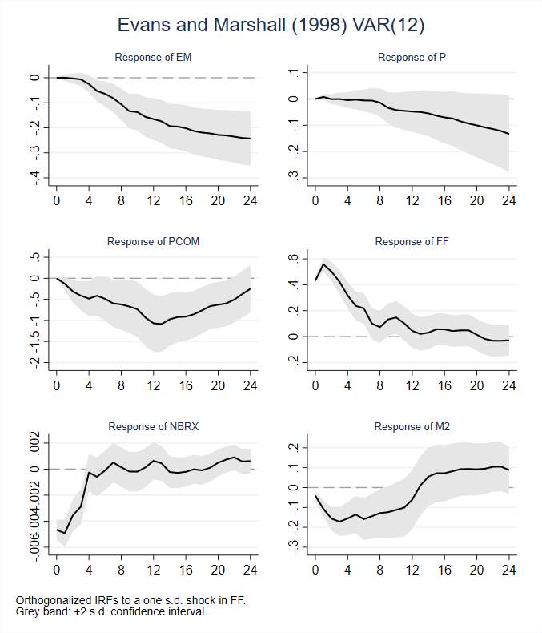
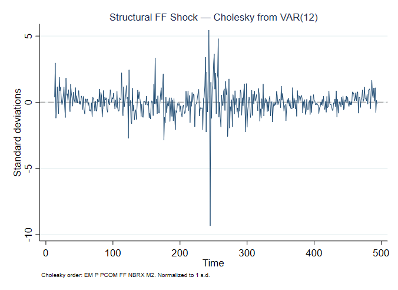
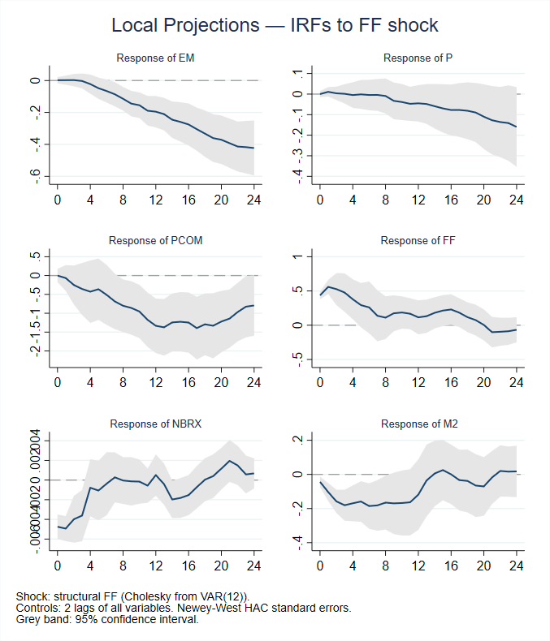
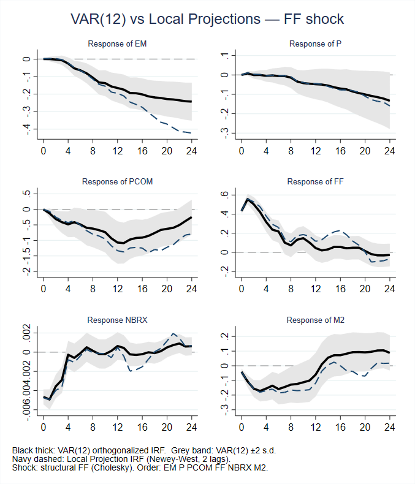

<div align="center">

# Jordà (2005)
### Local Projections — A Replication in Stata

[]()
[]()
[]()
[]()

*Part of the [`replications`](../../README.md) repository by [Juan Nicolás D'Amico](https://github.com/juan-damico)*

</div>

---

## The Paper

> **Jordà, Ò. (2005).** Estimation and inference of impulse responses by local projections. *American Economic Review*, 95(1), 161–182.

Jordà (2005) proposes Local Projections (LP) as an alternative to the VAR-based approach for estimating impulse response functions. Rather than inverting a fitted VAR model, LPs estimate each horizon of the IRF directly via a sequence of regressions of the outcome variable shifted $h$ periods ahead on a shock and a set of controls. The method is robust to misspecification of the data-generating process and straightforward to implement. This replication follows Evans & Marshall (1998) as the empirical application, using a six-variable monthly system and a monetary policy shock identified via Cholesky decomposition.

---

## 📁 Repository Structure
```bash
local-projections/
├── code/
├── data/
├── figures/
└── jorda-2005.md
```

### Variables

The system follows Evans & Marshall (1998) and consists of six monthly U.S. macroeconomic variables from January 1960 to February
2001 (494 observations).

| Variable | Description |
|---|---|
| `em` | Employment (log) |
| `p` | Price level (log) |
| `pcom` | Commodity prices (log) |
| `ff` | Federal funds rate |
| `nbrx` | Nonborrowed reserves (log) |
| `m2` | Money supply M2 (log) |


### Step 1 — VAR(12) as Benchmark

The first step estimates a reduced-form VAR with 12 lags as a benchmark for the impulse response functions. Each variable is expressed as a linear function of 12 lags of all six variables in the system:

$$\mathbf{y}_t = \mathbf{c} + \sum_{l=1}^{12} \mathbf{A}_l\, \mathbf{y}_{t-l} + \boldsymbol{\varepsilon}_t, \qquad \boldsymbol{\varepsilon}_t \sim \mathcal{N}(\mathbf{0},\, \boldsymbol{\Sigma})$$

where $\mathbf{y}_t = (\text{em}_t, p_t, \text{pcom}_t, \text{ff}_t, \text{nbrx}_t, \text{m2}_t)'$ is the $6 \times 1$ vector of endogenous variables, $\mathbf{A}_l$ is the $6 \times 6$ coefficient matrix at lag $l$, and $\boldsymbol{\Sigma} = \mathbb{E}[\boldsymbol{\varepsilon}_t \boldsymbol{\varepsilon}_t']$ is the reduced-form covariance matrix.

Orthogonalized IRFs are obtained via **Cholesky decomposition** of $\boldsymbol{\Sigma}$, with the recursive ordering:

$$\text{em} \longrightarrow p \longrightarrow \text{pcom} \longrightarrow \text{ff} \longrightarrow \text{nbrx} \longrightarrow \text{m2}$$

This encodes the assumption that monetary policy (`ff`) responds contemporaneously to output, prices, and commodity prices, but that nonborrowed reserves and money supply adjust after the policy rate within the period.

<div align="center">



</div>

<sub>Figure 1: Orthogonalized IRFs from a VAR(12) to a one standard deviation shock in the federal funds rate. Grey band: ±2 standard deviation confidence interval. Cholesky ordering: EM → P → PCOM → FF → NBRX → M2.</sub>

---

### Step 2 — Structural Shock Identification

The structural monetary policy shock is extracted directly from the VAR(12) residuals via Cholesky decomposition. The reduced-form residual of `ff` is purged of its contemporaneous dependence on `em`, `p`, and `pcom` by projecting it onto those residuals:

$$\hat{\varepsilon}_{ff,t}^{\perp} = \varepsilon_{ff,t} - \hat{\beta}_1 \varepsilon_{em,t} - \hat{\beta}_2 \varepsilon_{p,t} - \hat{\beta}_3 \varepsilon_{pcom,t}$$

The resulting series is then normalized to unit standard deviation, yielding the structural shock $s_t$ used in the local projection step:

$$s_t = \frac{\hat{\varepsilon}_{ff,t}^{\perp}}{\text{sd}(\hat{\varepsilon}_{ff,t}^{\perp})}$$

<div align="center">
  


</div>

<sub>Figure 2: Structural federal funds rate shock identified via Cholesky decomposition of the VAR(12) residuals. Normalized to unit standard deviation. Ordering: EM → P → PCOM → FF → NBRX → M2.</sub>

---

### Step 3 — Local Projections

Following Jordà (2005), the impulse response at horizon $h$ is estimated directly via a sequence of OLS regressions. For each response variable $y_{i}$ with $i \in \lbrace\text{EM}, \text{P}, \text{PCOM}, \text{FF}, \text{NBRX}, \text{M2}\rbrace$ and each horizon $h = 0, 1, \ldots, 24$:

$$y_{i,t+h} = \alpha_{i}^{(h)} + \beta_{i}^{(h)} \hat{\varepsilon}_{t}^{ff} + \sum_{l=1}^{12} \boldsymbol{\Gamma}_{l}^{(h)} \mathbf{X}_{t-l} + u_{i,t+h}$$

where $\hat{\varepsilon}\_{t}^{ff}$ is the structural federal funds rate shock identified in Step 2, and $\mathbf{X}\_{t-l}$, and $\mathbf{X}\_{t-l}$ is the full vector of 12 lags of all six variables in the system. The impulse response at horizon $h$ is given directly by the estimated coefficient $\hat{\beta}\_{i}^{(h)}$.

Because the dependent variable is projected $h$ steps ahead, the regression error $u\_{i,t+h}$ follows a moving-average process of order $h-1$ by construction. Standard errors are therefore computed using the **Newey-West HAC** estimator (with 2 lags) to ensure consistent inference. Confidence bands correspond to the 95% interval $\hat{\beta}\_{i}^{(h)} \pm 2 \cdot \hat{\sigma}\_{i}^{(h)}$.

A separate regression is estimated for each horizon $h$ and each response variable $i$ — this is the defining feature of Local Projections relative to the VAR, which obtains all horizons jointly through iteration of a single system.

Estimation is carried out using the `locproj` command (Ugarte-Ruiz, 2025).

<div align="center">
  


</div>

<sub>Figure 3: Local Projection IRFs to a one-standard-deviation structural shock in the federal funds rate. Grey band: 95% Newey-West confidence interval. Controls: 12 lags of all six variables. Horizon: 24 months.</sub>

---

### Step 4 — VAR vs. Local Projections

The final step overlays the VAR(12) and LP IRFs in a single figure for each variable, allowing a direct comparison of the two approaches. Both are identified from the same Cholesky ordering and the same structural shock.

The key methodological distinction is that the VAR IRFs are obtained by iterating the estimated system forward — each horizon depends on all previous ones — while the LP IRFs are estimated horizon-by-horizon independently. As a result, LP IRFs are more robust to misspecification but typically wider confidence bands at longer horizons.

<div align="center">
  


</div>

<sub>Figure 4: Comparison of VAR(12) orthogonalized IRFs (black, with ±2 s.d. grey band) and Local Projection IRFs (navy dashed) to a one standard deviation federal funds rate shock. Both methods use the same Cholesky identification. Horizon: 24 months.</sub>

---

## Implementation

The full replication is carried out in a single Stata `.do` file divided into four self-contained steps:

| Step | Description | Key Command |
|---|---|---|
| 1 | Estimate VAR(12) and plot orthogonalized IRFs | `var`, `irf create`, `twoway` |
| 2 | Extract and plot the structural FF shock | `predict`, `reg`, `twoway` |
| 3 | Estimate Local Projections and plot IRFs | `locproj`, `twoway` |
| 4 | Overlay VAR and LP IRFs for comparison | `twoway`, `graph combine` |

The `locproj` package must be installed before running Step 3:

```stata
ssc install locproj
```

---

## Citation

**Original Paper**
```bibtex
@article{jorda2005estimation,
  title     = {Estimation and inference of impulse responses by local projections},
  author    = {Jord{\`a}, \`Oscar},
  journal   = {American Economic Review},
  volume    = {95},
  number    = {1},
  pages     = {161--182},
  year      = {2005},
  publisher = {American Economic Association}
}
```
**Evans & Marshall (1998) - VAR Model**
```bibtex
@inproceedings{evans1998monetary,
  title={Monetary policy and the term structure of nominal interest rates: evidence and theory},
  author={Evans, Charles L and Marshall, David A},
  booktitle={Carnegie-Rochester Conference Series on Public Policy},
  volume={49},
  pages={53--111},
  year={1998},
  organization={Elsevier}
}
```
**Local Projection - Stata package**
```bibtex
@article{ugarte2025locproj,
  title={Locproj \& Lpgraph: Stata commands to estimate Local Projections},
  author={Ugarte-Ruiz, Alfonso},
  journal={BBVA Research WP},
  pages={25--09},
  year={2025}
}
```

**This Replication**
```bibtex
@misc{damico2026replications,
  author       = {D'Amico, Juan Nicolas},
  title        = {Replication of Jord{\`a} (2005): Local Projections},
  year         = {2026},
  howpublished = {\url{https://github.com/juan-damico/replications}},
  note         = {GitHub repository}
}
```

---

## Dataset

The dataset used in this replication is from Evans & Marshall (1998) and contains monthly U.S. macroeconomic data. The six variables are the same series used in the original Jordà (2005) paper. Most can be sourced directly from [FRED](https://fred.stlouisfed.org/), though two require additional attention:

| Variable | Description | FRED Series | Notes |
|---|---|---|---|
| `em` | Total nonfarm employment | [`PAYEMS`](https://fred.stlouisfed.org/series/PAYEMS) | Available |
| `p` | Consumer price index | [`CPIAUCSL`](https://fred.stlouisfed.org/series/CPIAUCSL) | Available |
| `pcom` | Commodity price index | — | **Not on FRED.** Evans & Marshall use the Dow Jones Spot Commodity Index, available from Global Financial Data or the IMF |
| `ff` | Federal funds rate | [`FEDFUNDS`](https://fred.stlouisfed.org/series/FEDFUNDS) | Available |
| `nbrx` | Nonborrowed reserves | [`BOGNONBR`](https://fred.stlouisfed.org/series/BOGNONBR) | **Discontinued July 2013.** Seasonally adjusted data up to 2013 is still accessible; the unadjusted replacement is [`NONBORRES`](https://fred.stlouisfed.org/series/NONBORRES) |
| `m2` | M2 money stock | [`M2SL`](https://fred.stlouisfed.org/series/M2SL) | Available |

Because the commodity price index is not available on FRED and the nonborrowed reserves series has been discontinued in its seasonally adjusted form, the dataset cannot be fully reconstructed from FRED alone for the original sample period. The `evansmarshall.dta` file in the `data/` folder contains the series as used in the paper.

---

## Complete Replication Script (Stata DO File)

This repository provides modular code to reproduce the main components of the analysis (data preparation, shock construction, and impulse response estimation) separately.

For those interested in a fully integrated and polished workflow, including customized graphs and a professionally structured script, a complete Stata DO file is available at the link below:

[](https://jdeconomicstore.com/b/local-projections-jorda2005)

*Note: This DO file is my property and is not endorsed by the original authors. It is an independent replication and as such it may present discrepancies relative to the original work.*

---

## Disclaimer

This is an independent replication developed by Juan D'Amico for educational and research purposes, and is not affiliated with or endorsed by the original authors. Discrepancies from the original paper may arise due to data availability, software differences, or interpretation choices. Please cite both the original paper and this repository if you use this work.

---

<div align="center">

*← Back to [`replications`](../../README.md)*

</div>
