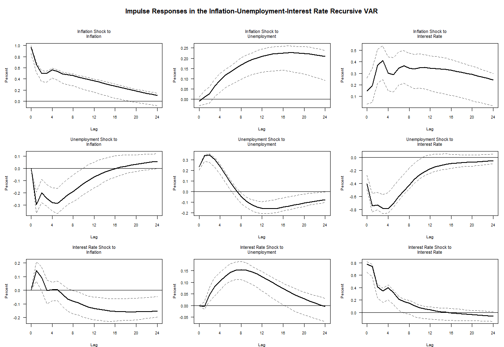

<div align="center">

# Stock & Watson (2001)
### Vector Autoregressions — A Replication in R

[](https://www.r-project.org/)
[]()
[]()
[]()

*Part of the [`replications`](../../../README.md) repository by [Juan Nicolás D'Amico](https://github.com/juan-damico)*

</div>

---

## The Paper

> **Stock, J. H., & Watson, M. W. (2001).** Vector autoregressions. *Journal of Economic Perspectives*, 15(4), 101–115.

This paper provides one of the most accessible and widely cited introductions to **Vector Autoregressive (VAR)** models in macroeconomics. Stock & Watson demonstrate how VARs can be used to capture dynamic relationships between multiple time series, forecast macroeconomic variables, and identify structural shocks through impulse-response analysis.

---

## Objective

Replicate the core VAR workflow from Stock & Watson (2001) in R, documenting every step from raw data to impulse-response functions — with enough clarity that the code serves as a standalone learning resource.

---

## Repository Structure

```
stock-watson-2001/
├── data/
│   ├── raw/                    # Original source data
│   └── processed/              # Cleaned, stationary series
├── R/
│   ├── 01_data_prep.R          # Loading, transformations, stationarity tests
│   ├── 02_lag_selection.R      # AIC / BIC / HQ criteria
│   ├── 03_var_estimation.R     # Reduced-form VAR estimation
│   └── 04_irf_analysis.R       # Impulse-response functions + confidence bands
├── figures/
│   └── figure.png              # IRF plots
└── README.md
```

---

## Workflow

```
Raw Data → Stationarity Tests → Lag Selection → VAR Estimation → IRF Analysis → Results
```

### Steps

**1. Data Preparation** — Variable selection, unit root tests (ADF/KPSS), and transformations (log-differences, detrending) to ensure stationarity before estimation.

**2. Lag Selection** — Comparison of information criteria (AIC, BIC, Hannan-Quinn) to determine the optimal lag length for the VAR system.

**3. VAR Estimation** — Estimation of the reduced-form VAR using OLS equation by equation, following the specification in Stock & Watson (2001).

**4. Impulse-Response Analysis** — Computation of orthogonalized IRFs via Cholesky decomposition, with bootstrapped confidence bands. Interpretation of dynamic responses to structural shocks.

---

## Getting Started

### Requirements

```r
install.packages(c("vars", "tseries", "urca", "ggplot2", "dplyr", "readr"))
```

### Run the replication

```r
setwd("R/")

source("01_data_prep.R")
source("02_lag_selection.R")
source("03_var_estimation.R")
source("04_irf_analysis.R")
```

Each script is self-contained and annotated. Run them in order for the full pipeline.

---

## Model Specification

A Vector Autoregression (VAR) is a multivariate time series model in which each endogenous variable is expressed as a linear function of its own past values and the past values of all other variables in the system. Unlike single-equation models, the VAR treats all variables as jointly endogenous, allowing for rich dynamic interactions across equations. Each equation shares the same right-hand side regressors — $p$ lags of every variable in the system — and is estimated by OLS equation by equation.

The system consists of three endogenous variables — inflation ($\pi_t$), unemployment rate ($u_t$), and the federal funds rate ($r_t$) — ordered following Stock & Watson (2001), with $p = 4$ lags and a constant term in each equation.

### Equation Form

$$\pi_t = c_1 + \sum_{l=1}^{4} \alpha_{11}^{(l)} \pi_{t-l} + \sum_{l=1}^{4} \alpha_{12}^{(l)} u_{t-l} + \sum_{l=1}^{4} \alpha_{13}^{(l)} r_{t-l} + \varepsilon_{1t}$$

$$u_t = c_2 + \sum_{l=1}^{4} \alpha_{21}^{(l)} \pi_{t-l} + \sum_{l=1}^{4} \alpha_{22}^{(l)} u_{t-l} + \sum_{l=1}^{4} \alpha_{23}^{(l)} r_{t-l} + \varepsilon_{2t}$$

$$r_t = c_3 + \sum_{l=1}^{4} \alpha_{31}^{(l)} \pi_{t-l} + \sum_{l=1}^{4} \alpha_{32}^{(l)} u_{t-l} + \sum_{l=1}^{4} \alpha_{33}^{(l)} r_{t-l} + \varepsilon_{3t}$$

### Matrix Form

$$
\begin{aligned}
\begin{bmatrix}
\pi_t\\
u_t\\
r_t
\end{bmatrix}
&=
\begin{bmatrix}
c_1\\
c_2\\
c_3
\end{bmatrix}
+
\sum_{l=1}^{4}
\begin{bmatrix}
\alpha_{11}^{(l)} & \alpha_{12}^{(l)} & \alpha_{13}^{(l)} \\
\alpha_{21}^{(l)} & \alpha_{22}^{(l)} & \alpha_{23}^{(l)} \\
\alpha_{31}^{(l)} & \alpha_{32}^{(l)} & \alpha_{33}^{(l)}
\end{bmatrix}
\begin{bmatrix}
\pi_{t-l}\\
u_{t-l}\\
r_{t-l}
\end{bmatrix}
+
\begin{bmatrix}
\varepsilon_{1t}\\
\varepsilon_{2t}\\
\varepsilon_{3t}
\end{bmatrix}.
\end{aligned}
$$

where $\boldsymbol{\varepsilon}_t \sim \mathcal{N}(\mathbf{0}, \boldsymbol{\Sigma})$ and $\boldsymbol{\Sigma}$ is a $3 \times 3$ positive definite covariance matrix.
### Compact Form

$$\mathbf{y}_t = \mathbf{c} + \sum_{l=1}^{4} \mathbf{A}_l\, \mathbf{y}_{t-l} + \boldsymbol{\varepsilon}_t, \qquad \boldsymbol{\varepsilon}_t \sim \mathcal{N}(\mathbf{0},\, \boldsymbol{\Sigma})$$

where $\mathbf{y}_t = (\pi_t,\, u_t,\, r_t)'$ is the $3 \times 1$ vector of endogenous variables, $\mathbf{A}_l$ is the $3 \times 3$ coefficient matrix at lag $l$, $\mathbf{c}$ is a $3 \times 1$ vector of intercepts, and $\boldsymbol{\Sigma} = \mathbb{E}[\boldsymbol{\varepsilon}_t \boldsymbol{\varepsilon}_t']$ is the reduced-form covariance matrix.

This is the **reduced-form VAR**: each equation is estimated by OLS and the residuals $\boldsymbol{\varepsilon}_t$ are reduced-form disturbances — linear combinations of the underlying structural shocks. As such, they carry no direct structural interpretation. Identification of economically meaningful shocks requires an additional assumption, introduced in the next section via Cholesky decomposition of $\boldsymbol{\Sigma}$.

---

## Identification: Recursive Ordering

Structural shocks are recovered via **Cholesky decomposition** of the reduced-form covariance matrix $\boldsymbol{\Sigma} = \mathbf{P}\mathbf{P}'$, where $\mathbf{P}$ is lower triangular. This imposes a **recursive causal ordering**: a variable can be affected contemporaneously only by variables that precede it in the ordering, while all lagged cross-variable effects remain unrestricted.

The ordering follows Stock & Watson (2001) exactly:

$$\pi_t \longrightarrow u_t \longrightarrow r_t$$

This encodes the following identifying assumptions for the current period $t$:

| | $\pi_t$ shock | $u_t$ shock | $r_t$ shock |
|---|:---:|:---:|:---:|
| **Inflation** $\pi_t$ | ✓ | ✗ | ✗ |
| **Unemployment** $u_t$ | ✓ | ✓ | ✗ |
| **Fed Funds Rate** $r_t$ | ✓ | ✓ | ✓ |

Inflation ($\pi_t$) does not respond contemporaneously to unemployment or monetary policy shocks — as the first variable in the ordering, the price level is assumed to be predetermined within the quarter.

Unemployment ($u_t$) does not respond contemporaneously to monetary policy shocks — real activity is assumed to react to interest rate changes only with a lag.

The Federal Funds Rate ($r_t$) responds contemporaneously to all shocks — the Fed is assumed to observe current inflation and unemployment before setting the policy rate within the period. All variables interact freely across lags.

---

## Results

### Impulse-Response Functions

An impulse-response function (IRF) traces the dynamic effect of a one-unit shock to one variable on all other variables in the system over a given horizon. In a VAR with $n$ variables, there are $n^2$ such response paths — one for each shock-response pair — which together describe the full propagation of shocks through the system.

Because VAR residuals are typically correlated across equations, raw shocks cannot be interpreted as economically meaningful. To recover interpretable structural shocks, the residuals must be orthogonalized via the Cholesky decomposition described above.



<sub>Figure 1: Orthogonalized impulse-response functions from a VAR(4) estimated on inflation, unemployment, and the federal funds rate. Identification via Cholesky decomposition with ordering: inflation → unemployment → federal funds rate, following Stock & Watson (2001). Dashed lines represent 68% bootstrap confidence bands. Horizon measured in quarters.</sub>

---

## Citation

**Original Paper**
```bibtex
@article{stock2001vector,
  title     = {Vector autoregressions},
  author    = {Stock, James H and Watson, Mark W},
  journal   = {Journal of Economic Perspectives},
  volume    = {15},
  number    = {4},
  pages     = {101--115},
  year      = {2001},
  publisher = {American Economic Association}
}
```

**This Replication**
```bibtex
@misc{damico2026replications,
  author       = {D'Amico, Juan Nicolas},
  title        = {Replication of Stock and Watson (2001): Vector Autoregressions},
  year         = {2026},
  howpublished = {\url{https://github.com/juan-damico/replications}},
  note         = {GitHub repository}
}
```

---

## Disclaimer

This is an independent replication developed by Juan D'Amico for educational and research purposes, and is not affiliated with or endorsed by the original authors. Discrepancies from the original paper may arise due to data availability, software differences, or interpretation choices. Please cite both the original paper and this repository if you use this work.

---

<div align="center">

*← Back to [`replications`](../../../README.md)*

</div>
